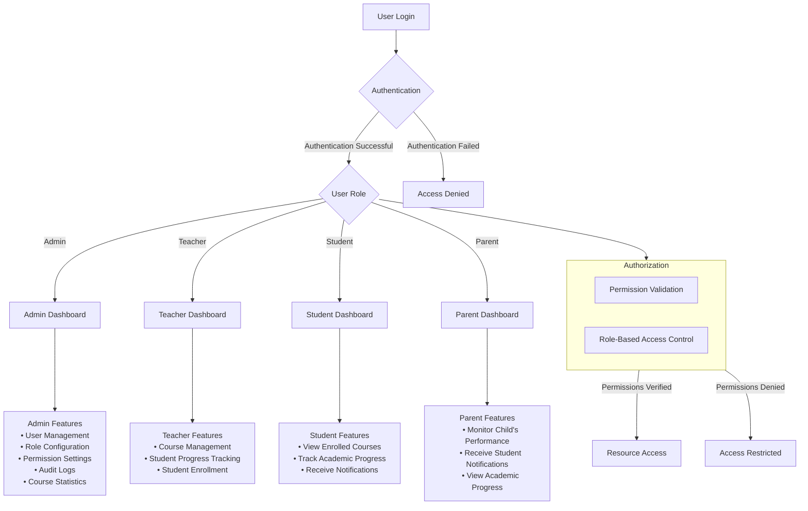

# Educational RBAC System

## Project Overview

The **Educational Role-Based Access Control (RBAC)** system is a web application developed using **Angular** to demonstrate the concepts of **user roles**, **permissions**, and **authentication** within an educational environment. This system allows institutions (such as schools or universities) to manage user access to various resources based on their roles, ensuring the right level of permissions for different types of users. The system is designed to offer flexibility and security in managing user roles and permissions within an educational setting.



---

## Features

### 1. **User Authentication**
   - The system supports **secure user authentication** with login functionality.
   - Different **roles** (Admin, Teacher, Student, Parent) are assigned specific permissions based on the user’s role.
   - Users must authenticate with predefined credentials to access the platform.
   - Once authenticated, the system maintains user sessions to prevent unauthorized access.

### 2. **Dashboard**
   - The **Admin Dashboard** is fully implemented, allowing admins to manage users, roles, and permissions, as well as view audit logs and course-related statistics.
   - **Teachers**, **Students**, and **Parents** dashboards are planned for future implementation. These dashboards will be tailored to each role, offering features such as:
     - **Teachers**: Manage courses, track student progress, and view related data.
     - **Students**: View enrolled courses, monitor academic progress, and receive notifications.
     - **Parents**: View their child’s academic progress and receive notifications related to student performance.

### 3. **Role Management**
   - The **Admin Panel** allows for the creation, modification, and deletion of user roles.
   - **Permissions** can be assigned or revoked for each role, defining the actions (read, write, update, delete) allowed for users in that role.
   - Roles include **Admin**, **Teacher**, **Student**, and **Parent**, with custom roles available based on organizational needs.
   - Dynamic role management enables admins to easily configure and adapt the platform to different educational contexts.

### 4. **Course Management**
   - The system provides functionality for **course creation**, **editing**, and **deletion**.
   - **Teachers** and **Admins** can manage courses, assign students, and view statistics such as enrollment numbers, completion rates, etc.
   - **Course statistics** are generated and displayed, allowing administrators and teachers to track progress and engagement.

### 5. **Audit Logs**
   - **Audit logging** tracks user activities and changes within the system, such as role and permission modifications.
   - Admins can view logs to ensure accountability and transparency, helping detect and investigate unauthorized actions or changes.

### 6. **Notifications**
   - **Role-based notifications** are planned for implementation, allowing admins to send updates to **Teachers**, **Students**, and **Parents** about important academic events, assignments, or changes.
   - Notifications will be tailored to each role, ensuring users only receive relevant information.

---

## Installation

To set up the project locally, follow these steps:

### Step 1: Clone the Repository
```bash
git clone https://github.com/Uttam-Mahata/educational-rbac.git
cd educational-rbac
```

### Step 2: Install Dependencies
Ensure that **Node.js** and **Angular CLI** are installed, then install the project dependencies:
```bash
npm install
```

### Step 3: Run the Application
Start the development server by running:
```bash
ng serve
```
The application will be available at `http://localhost:4200/`.

---

## Usage

1. **Login**: Use the following credentials to log in based on the role you want to test:
   - **Admin**: `admin/admin123`
   - **Teacher**: `teacher/teacher123`
   - **Student**: `student/student123`
   - **Parent**: `parent/parent123`

2. **Admin Dashboard**:
   - The **Admin Dashboard** is fully functional and allows the admin to manage users, roles, permissions, and view audit logs.
   - Admins can **assign roles** and **manage permissions** for each role, including creating, updating, or deleting roles.
   - Admins can also **view course statistics** and track user activity through audit logs.
   
3. **Teacher, Student, and Parent Dashboards**:
   - **Teacher, Student, and Parent dashboards** are currently **under development** and will be implemented in future updates. These dashboards will provide role-specific features such as:
     - **Teachers** will manage courses and student progress.
     - **Students** will track their enrolled courses and academic progress.
     - **Parents** will monitor their children’s performance and receive relevant notifications.

4. **Role Management**:
   - The Admin dashboard allows the creation, editing, and assignment of roles.
   - Admins can assign specific permissions (read, write, update, delete) for each module and ensure that users have the appropriate access level.

5. **Course Management**:
   - Admins and teachers can create, manage, and delete courses.
   - **Course statistics** are available, showing student enrollment and progress.

6. **Audit Logs**:
   - Admins can review logs for tracking user activities, such as modifications in roles, permissions, and courses.

---

## Contributing

We welcome contributions to further enhance the functionality of the system. Here's how you can contribute:

1. **Fork** the repository to your own GitHub account.
2. Create a new branch for your feature:
   ```bash
   git checkout -b feature-branch
   ```
3. **Make your changes**.
4. Commit your changes:
   ```bash
   git commit -m "Add a new feature"
   ```
5. Push your changes to your fork:
   ```bash
   git push origin feature-branch
   ```
6. Open a **pull request** for review.

---

## Acknowledgments

- **Icons**: Powered by [FontAwesome](https://fontawesome.com/).
- **Logos & Images**: Sourced from [Winners Education](https://winnerseducation.org/).

---

Feel free to customize the platform with additional features, such as advanced analytics, third-party integrations, or more detailed permission controls for each educational module.
